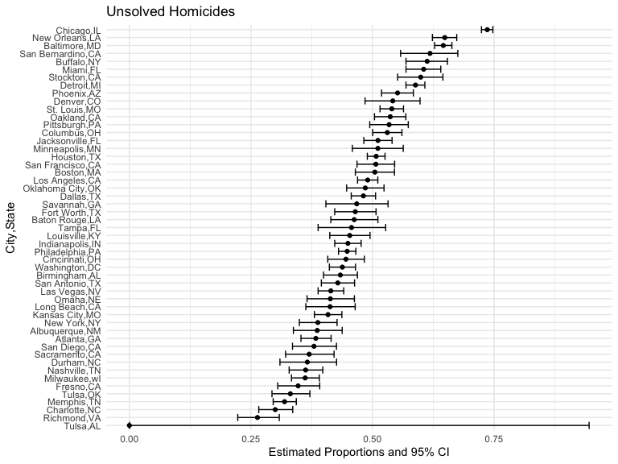
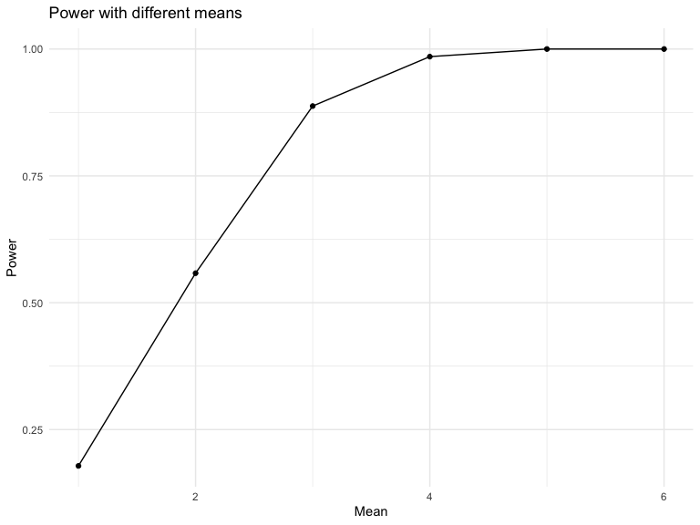

Homework 5
================
Mingee Choi
11/16/2022

# Problem 2

\###Description of raw data:

``` r
homicide_data=
  read_csv("./data/homicide-data.csv")%>%
  janitor::clean_names()%>%
  mutate(reported_date = lubridate::ymd(reported_date))%>%
  drop_na(reported_date)
```

    ## Rows: 52179 Columns: 12
    ## ── Column specification ────────────────────────────────────────────────────────
    ## Delimiter: ","
    ## chr (9): uid, victim_last, victim_first, victim_race, victim_age, victim_sex...
    ## dbl (3): reported_date, lat, lon
    ## 
    ## ℹ Use `spec()` to retrieve the full column specification for this data.
    ## ℹ Specify the column types or set `show_col_types = FALSE` to quiet this message.

The `homicide_data` has 52177 observations and 12 variables and tells us
about homicides in 50 large U.S. cities a given year from years
2007-01-01 to 2017-12-31. The variables include victim’s first name,
victim’s second name, victim’s age, victim’s sex, city, state, latitude,
longitude, and disposition.

\###Create variable and summarize

Create city_state variable and summarize within cities to obtain the
total number of homicides and the number of unsolved homicides (those
for which disposition is “closed without arrest” or “open/no arrest”)

``` r
homicide_df=
homicide_data%>%
  mutate(city_state= str_c(city, state, sep=",")
  )%>%
  select(uid,city_state,everything())%>%
  group_by(city_state)%>%
  summarize(total_homicides = n(),  unsolved_homicides = sum(disposition%in%c("Closed without arrest", "Open/No arrest")))%>%
  arrange(desc(total_homicides))
```

\###Use prop.test for city of Baltimore, MD

``` r
baltimore_test=
  homicide_df%>%
  filter(city_state == "Baltimore,MD")%>%
  mutate(prop_test = map2(unsolved_homicides, total_homicides, ~prop.test(.x, .y)%>%
  broom::tidy()))%>%
  unnest()

save(baltimore_test, file="baltimore_test.RData")

  baltimore_test%>%
  select(city_state, estimate, "CI_lower" = conf.low, "CI_upper" = conf.high)
```

    ## # A tibble: 1 × 4
    ##   city_state   estimate CI_lower CI_upper
    ##   <chr>           <dbl>    <dbl>    <dbl>
    ## 1 Baltimore,MD    0.646    0.628    0.663

\###Prop.test for each cities

Prop.test for each cities in dataset and extract both the proportion of
unsolved homicides and the confidence interval for each

``` r
prop_test=
  homicide_df%>%
  mutate(prop_test = map2(unsolved_homicides, total_homicides, ~prop.test(.x, .y)%>%
  broom::tidy()))%>%
  unnest()

prop_test%>%
 select(city_state, estimate, "CI_lower" = conf.low, "CI_upper" = conf.high)
```

    ## # A tibble: 51 × 4
    ##    city_state      estimate CI_lower CI_upper
    ##    <chr>              <dbl>    <dbl>    <dbl>
    ##  1 Chicago,IL         0.736    0.724    0.747
    ##  2 Philadelphia,PA    0.448    0.430    0.466
    ##  3 Houston,TX         0.507    0.489    0.526
    ##  4 Baltimore,MD       0.646    0.628    0.663
    ##  5 Detroit,MI         0.588    0.569    0.608
    ##  6 Los Angeles,CA     0.490    0.469    0.511
    ##  7 St. Louis,MO       0.540    0.515    0.564
    ##  8 Dallas,TX          0.481    0.456    0.506
    ##  9 Memphis,TN         0.319    0.296    0.343
    ## 10 New Orleans,LA     0.649    0.623    0.673
    ## # … with 41 more rows

\###Plot of estimates and CIs for each city

``` r
prop_test%>%
  arrange(desc(estimate))%>%
 ggplot(aes(group = city_state, y = reorder(city_state, estimate))) + 
 geom_point(aes(x = estimate)) +
 geom_errorbar(aes(xmin = conf.low, xmax = conf.high)) +
 labs(y = "City,State", x = "Estimate and 95% CI",title = "Unsolved Homicides")
```



# Problem 3

\###t.test and estimate and p-value

``` r
sim_function = function(mu = 0) {
  sample = tibble(rnorm(n = 30, mean = mu, sd = 5))
  
  result = t.test(sample) %>% 
    broom::tidy() %>% 
    select(estimate,p.value)
  
  result
}
sim_function()
```

    ## # A tibble: 1 × 2
    ##   estimate p.value
    ##      <dbl>   <dbl>
    ## 1    0.412   0.629

\###t.test with different means

``` r
means_sample = 
  expand_grid(
    sample_size = 30,
    mean = 1:6,
    iter = 1:5000)%>%
  mutate(estimate_df = map(mean, sim_function))%>%
  unnest(estimate_df)
```

\###Plot showing power

``` r
means_sample %>%
  group_by(mean) %>%
  summarize(power = sum(p.value < 0.05)/5000) %>%
  ggplot(aes(x = mean,y = power)) +
  geom_point() + geom_path() +
  labs(x = "Mean",y = "Power",title = "Power with different means")
```


